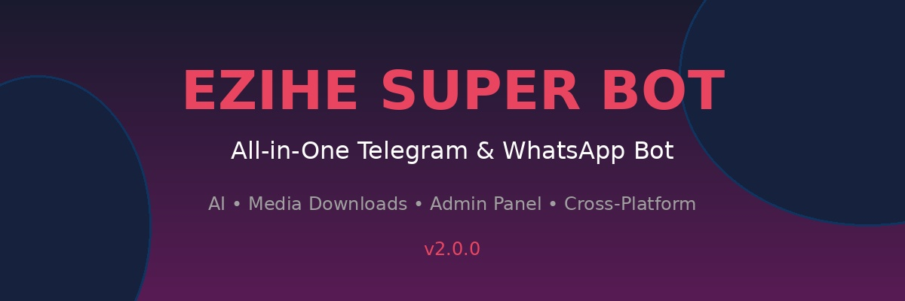

# EZIHE SUPER BOT 🤖

[](https://github.com/ezihe/ezihe-bot)
[](https://nodejs.org/)
[](LICENSE)

> An all-in-one powerful Telegram bot with AI features, media downloads, admin controls, and WhatsApp integration.



## ✨ Features

### 🔐 Security
- Password-protected access (default: `ezihe`)
- Owner-only commands for sensitive functions
- Bot lock/unlock system
- User ban/unban system

### 📥 Media Downloads
- **YouTube** - Videos, Shorts, Playlists
- **TikTok** - Videos without watermark
- **Instagram** - Posts, Reels, Stories
- **Pinterest** - Images & Videos
- Automatic link detection

### 🤖 AI Tools
- **AI Image Generator** - Create images from text
- **AI Video Generator** - Generate videos from descriptions
- **AI Chat** - Intelligent conversation

### 🎵 Music & Movies
- **Music Search** - Find and download any song
- **Movie Search** - Search movies with details & ratings
- **Streaming** - Direct audio/video playback

### 👮 Admin Tools
- **Tag All** - Mention all group members
- **Ban/Unban** - User management
- **Broadcast** - Send messages to all users
- **Settings** - Bot configuration
- **Statistics** - Usage analytics

### 📱 WhatsApp Integration
- **Pair Device** - Link using QR code or pairing code
- **Cross-Platform** - Use on both Telegram & WhatsApp
- **Message Sync** - Send/receive across platforms

## 🚀 Quick Start

### Prerequisites
- Node.js 18 or higher
- A Telegram Bot Token (from [@BotFather](https://t.me/BotFather))

### Installation

1. **Clone the repository**
```bash
git clone https://github.com/ezihe/ezihe-bot.git
cd ezihe-bot
```

2. **Install dependencies**
```bash
npm install
```

3. **Configure environment variables**
```bash
cp .env.example .env
# Edit .env with your settings
```

4. **Start the bot**
```bash
npm start
```

### Environment Variables

```env
# Required
BOT_TOKEN=your_telegram_bot_token
OWNER_ID=your_telegram_user_id

# Optional - for AI features
OPENAI_API_KEY=your_openai_key
STABILITY_API_KEY=your_stability_key
RUNWAY_API_KEY=your_runway_key

# Optional - for movie search
TMDB_API_KEY=your_tmdb_key
OMDB_API_KEY=your_omdb_key
```

## 📋 Commands

### General
| Command | Description |
|---------|-------------|
| `/start` | Start the bot |
| `/password [pass]` | Authenticate with password |
| `/menu` | Open main menu |
| `/help` | Show all commands |

### Media Downloads
| Command | Description |
|---------|-------------|
| `/yt [url]` | Download YouTube video |
| `/tiktok [url]` | Download TikTok video |
| `/ig [url]` | Download Instagram content |
| `/pinterest [url]` | Download Pinterest content |

### AI Tools
| Command | Description |
|---------|-------------|
| `/aiimg [prompt]` | Generate AI image |
| `/aivid [prompt]` | Generate AI video |
| `/ai [message]` | Chat with AI |

### Music & Movies
| Command | Description |
|---------|-------------|
| `/music [song]` | Search music |
| `/play [song]` | Play/download music |
| `/movie [title]` | Search movies |

### Admin Tools
| Command | Description |
|---------|-------------|
| `/admin` | Admin panel |
| `/lock` | Lock bot |
| `/unlock` | Unlock bot |
| `/tagall [msg]` | Tag all members |
| `/ban [user_id]` | Ban user |
| `/broadcast [msg]` | Send to all users |

### WhatsApp
| Command | Description |
|---------|-------------|
| `/whatsapp` | WhatsApp menu |
| `/pair` | Pair device |

## 🖼️ Menu System

The bot features an interactive menu system with:
- Clean, modern UI
- Organized categories
- Interactive buttons
- Banner images


## 🛠️ Deployment

### Using PM2 (Recommended)
```bash
npm install -g pm2
npm run pm2:start
```

### Using Docker
```bash
docker build -t ezihe-bot .
docker run -d --env-file .env ezihe-bot
```

### Using Heroku
[](https://heroku.com/deploy)

## 📁 Project Structure

```
ezihe-bot/
├── src/
│   ├── commands/       # Command implementations
│   ├── handlers/       # Feature handlers
│   ├── middleware/     # Auth & lock middleware
│   ├── services/       # External services
│   ├── utils/          # Utilities (logger, db)
│   ├── config/         # Configuration
│   └── index.js        # Entry point
├── assets/             # Images & banners
├── data/               # Database & sessions
├── logs/               # Log files
├── downloads/          # Temporary downloads
├── .env.example        # Environment template
├── package.json
└── README.md
```

## 🔧 Configuration

### Bot Settings
Edit `src/config/config.js` to customize:
- Download limits
- Rate limiting
- Feature flags
- Admin settings

### Database
The bot uses SQLite by default. Database file: `data/ezihe_bot.db`

## 📝 API Keys (Optional)

For enhanced AI features, get free API keys:

- **OpenAI** - [platform.openai.com](https://platform.openai.com)
- **Stability AI** - [stability.ai](https://stability.ai)
- **TMDB** - [developers.themoviedb.org](https://developers.themoviedb.org)

## 🤝 Contributing

1. Fork the repository
2. Create your feature branch (`git checkout -b feature/amazing`)
3. Commit your changes (`git commit -m 'Add amazing feature'`)
4. Push to the branch (`git push origin feature/amazing`)
5. Open a Pull Request

## 📄 License

This project is licensed under the MIT License - see the [LICENSE](LICENSE) file.

## 🙏 Credits

- [Telegraf](https://telegraf.js.org/) - Telegram Bot Framework
- [Baileys](https://github.com/whiskeysockets/Baileys) - WhatsApp API
- [ytdl-core](https://github.com/fent/node-ytdl-core) - YouTube downloader

## 📞 Support

- Telegram: [@ezihe_support](https://t.me/ezihe_support)
- Channel: [@ezihe_channel](https://t.me/ezihe_channel)

---

<p align="center">
  Made with ❤️ by <a href="https://t.me/ezihe">Ezihe</a>
</p>
